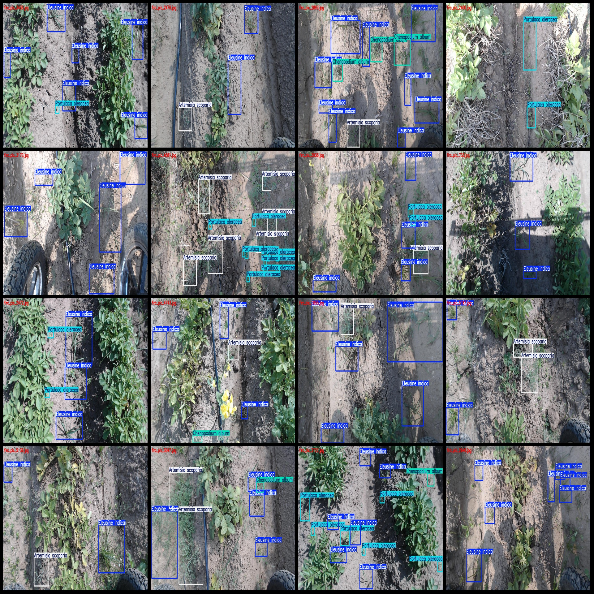
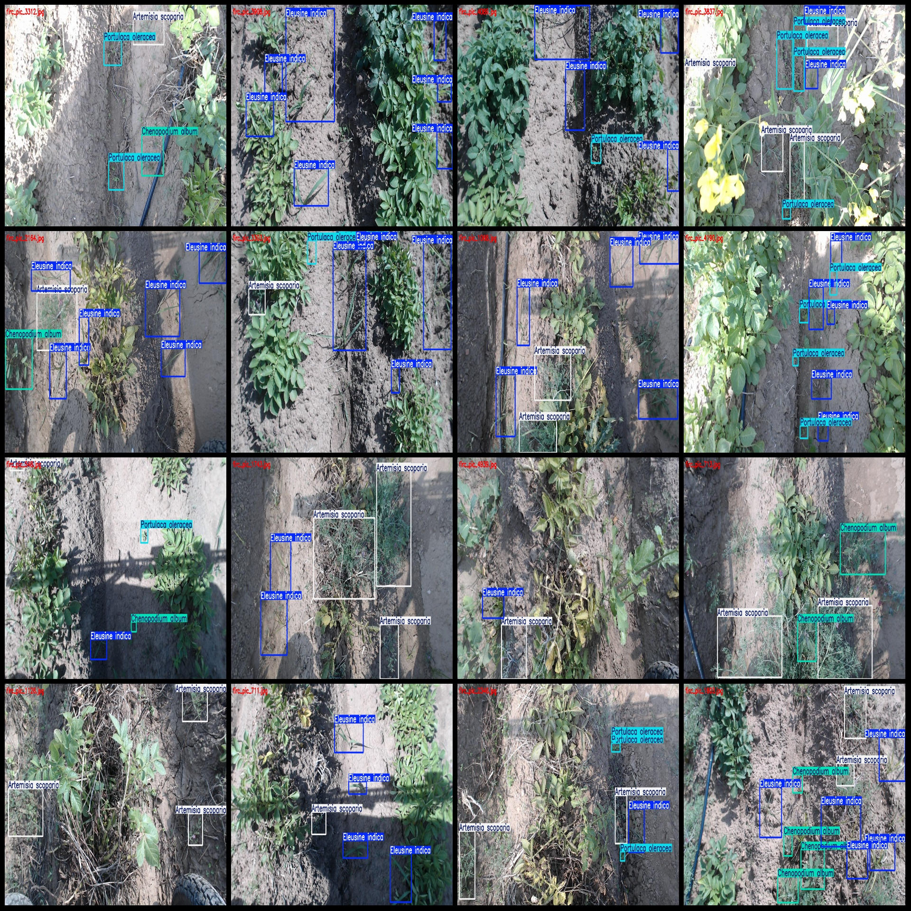
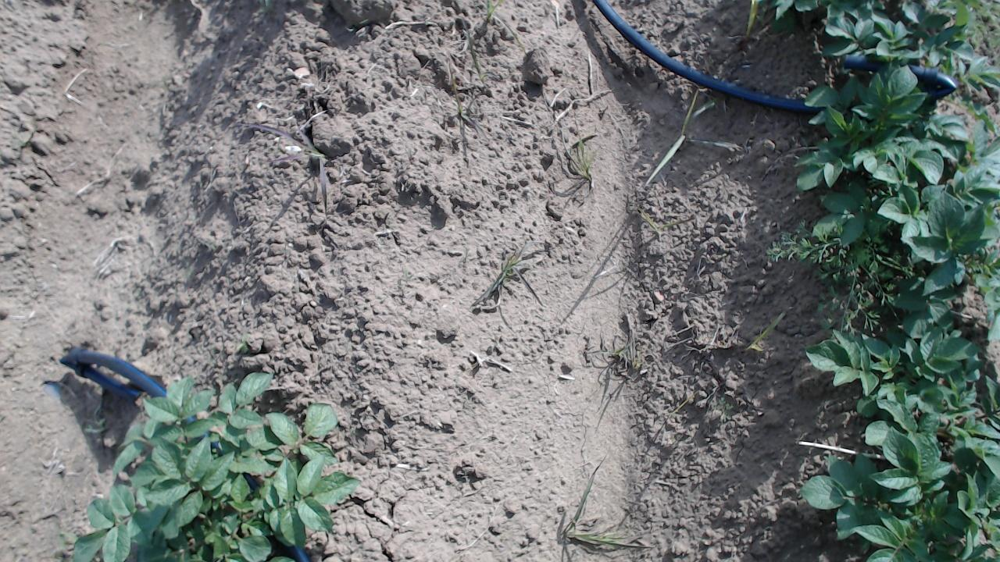

# Drone-Viewpoint Low-altitude Shooting Potato Tuber and Weed Detection Dataset VOC+YOLO format, 5266 images, 6 classes

The dataset format is Pascal VOC format + YOLO format. It does not contain split paths in the txtfile, but only contains jpg images and corresponding VOC format xmlfile and yolo format txtfile.
The number of jpg files is 5266.
The quantity (number of XML files) is 5266.
The number of txt files is 5266.
The number of labeled categories is 6.
The categories are labeled with the following names: ["Artemisia scoparia", "Chenopodium album", "Digitaria sanguinalis", "Eleusine indica", "Portulaca oleracea", "Sonchus arvensis"]
boxes per class:   
Artemisia scoparia (Indica)
The frame count of Chenopodium album (barley/alfalfa) is 2272.
The frame count for Digitaria sanguinalis, also known as the buffalo grass or "sang" in some regions, is 28.
The number of frames for Eleusine indica (Nigella sativa) is 13679.
Portulaca oleracea (Malva)
Sonchus arvensis is a plant that has been used in traditional Chinese medicine. It has been shown to have anti-inflammatory and antioxidant properties, which may help to reduce inflammation and improve overall health.
The total number of frames is 31664.
Number of images per category:
Artemisia scoparia (Artemisia)
Chenopodium album (Chenopodium)
Digitaria sanguinalis (Matang) occupies a picture count of 21.
Eleusine indica (Indigo Snakeroot) has 4063 images.
1915 images of Portulaca oleracea (Malva parviflora)
Sonchus arvensis (arvensis)
Image resolution: 1280x720
Use annotation tool: labelImg  
Annotation rules: draw rectangle boxes for class  
Important notes: dataset does not have a division of training validation test set, it needs to be divided by themselves.
Special Disclaimer: This dataset does not guarantee the accuracy of the trained model or weight files.
Image Preview:
## Image

Here is a pay link on Stripe ( https://buy.stripe.com/3cs8yP7sY87d0vu9AB ). Please contact me lonlonago@foxmail.com after funding $89, and I will send you a complete data files , thank you!

